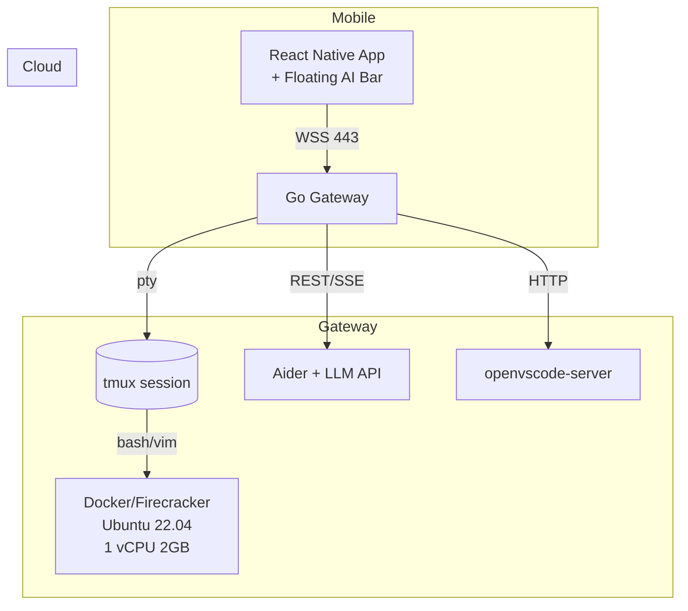

# DevTail Architecture Design

## High-Level Overview

DevTail is a mobile-first, AI-powered cloud development platform that combines:
- **Codespaces-grade** cloud development environments
- **Copilot-level** AI assistance with Aider integration
- **Termius-style** mobile terminal experience

### 30-Second Architecture



## Core Design Principles

1. **Single WebSocket** multiplexes chat, terminal, and IDE traffic
2. **tmux persistence** keeps shell alive through disconnects
3. **Aider integration** handles multi-file AI edits in-place
4. **Cross-device seamless** handoff from mobile to desktop
5. **Global connectivity** via Tailscale P2P + Cloudflare tunnels

## Component Architecture

### 1. Mobile App (React Native)

**Features:**
- Native terminal renderer with <50ms latency
- Floating AI assistant bar (Android overlay, iOS sheet)
- Hardware keyboard support with programming keys
- Gesture controls (pinch zoom, swipe tabs)
- Tailscale SDK for direct P2P connections

**Platform Differences:**
- **Android**: System overlay floating assistant
- **iOS**: Pull-up sheet with Dynamic Island status

### 2. Gateway (Go)

**Current Implementation:** `/gateway/`
- WebSocket multiplexer using gorilla/websocket
- Terminal PTY management with creack/pty
- Chat handler with mock Aider integration
- Protocol message types and compression support

**Enhancements Needed:**
- Real Aider CLI integration
- Protocol Buffer binary messaging
- Connection state management
- Message buffering and replay
- tmux session orchestration

### 3. Control Plane (Go)

**Current Implementation:** `/control-plane/`
- Hetzner Cloud VM provisioning
- Tailscale network setup
- PostgreSQL database with migrations
- Cloud-init VM bootstrap scripts

**Architecture:**
```go
type Manager struct {
    db              *sql.DB
    hetznerClient   *hetzner.Client
    tailscaleClient *tailscale.Client
    config          Config
}
```

### 4. Development Environment

**VM Specification:**
- **Cloud Provider**: Hetzner (€3.79/mo for CX11)
- **OS**: Ubuntu 22.04 LTS
- **Resources**: 1 vCPU, 2GB RAM, 40GB SSD
- **Networking**: Tailscale mesh + public IP
- **Runtime**: Docker containers or Firecracker micro-VMs

**Software Stack:**
- Node.js 20 LTS
- Aider CLI with GPT-4/Claude API access
- tmux for session management
- openvscode-server for desktop IDE
- Git with SSH key management

## Protocol Design

### Message Types

**Current (JSON-based):**
```go
type Message struct {
    ID            string          `json:"id"`
    Type          MessageType     `json:"type"`
    Timestamp     time.Time       `json:"timestamp"`
    Payload       json.RawMessage `json:"payload,omitempty"`
    SeqNum        uint64          `json:"seq_num,omitempty"`
    RequiresAck   bool            `json:"requires_ack,omitempty"`
    RetryCount    int             `json:"retry_count,omitempty"`
    CorrelationID string          `json:"correlation_id,omitempty"`
}
```

**Target (Protocol Buffers):**
- Binary encoding for mobile efficiency
- Schema evolution support
- Compression with zstd algorithm
- Message fragmentation for large responses

### Connection Flow

1. **Authentication**: JWT token via WebSocket upgrade
2. **Session Resume**: Client sends last sequence number
3. **Message Buffering**: Gateway queues missed messages
4. **Heartbeat**: Ping/pong every 30 seconds
5. **Reconnection**: Exponential backoff with circuit breaker

## AI Integration Strategy

### Aider Integration

**Current State:**
- Mock implementation using `echo-aider.py`
- Basic subprocess management
- Token-based streaming responses

**Target Implementation:**
```go
type AiderHandler struct {
    cmd         *exec.Cmd
    stdin       io.WriteCloser
    stdout      io.ReadCloser
    stderr      io.ReadCloser
    workDir     string
    context     *ConversationContext
}
```

### LLM Strategy

**Tiered Approach:**
1. **Fast**: GPT-4-mini for quick suggestions ($0.15/1M tokens)
2. **Quality**: GPT-4-turbo/Claude-Sonnet for complex refactors
3. **Cost-effective**: Self-hosted Code-Llama-70B on vLLM
4. **China fallback**: Qwen-14B in Hong Kong region

**Cost Controls:**
- Per-user token budgets with soft/hard limits
- Smart routing based on prompt complexity
- Response caching for common queries
- BYO API key option for power users

## File Operations

### Sync Protocol

**Design Requirements:**
- Efficient diff-based synchronization
- Real-time file watching with debouncing
- Conflict resolution for concurrent edits
- Git integration for status monitoring

**Implementation Approach:**
```go
type FileSyncHandler struct {
    watcher   *fsnotify.Watcher
    differ    *DiffGenerator
    gitRepo   *git.Repository
    buffer    *ChangeBuffer
}
```

### Git Integration

**Features:**
- Real-time status monitoring
- Diff generation for AI context
- Automatic staging of AI changes
- Conflict detection and resolution

## Performance Targets

### Latency Goals
- **Keystroke to display**: <50ms end-to-end
- **Connection establishment**: <2 seconds
- **AI response start**: <500ms (first token)
- **File sync propagation**: <100ms

### Efficiency Metrics
- **Idle bandwidth**: <1KB/minute
- **Battery usage**: <5% per hour active use
- **Memory footprint**: <100MB mobile app
- **Compression ratio**: 70%+ for terminal data

## Security Architecture

### Authentication & Authorization
- **Mobile**: Biometric + JWT tokens
- **Backend**: RBAC with user/team/admin roles
- **VM Access**: SSH keys + Tailscale ACLs
- **API**: Rate limiting + DDoS protection

### Data Protection
- **Credentials**: Encrypted storage on device
- **Transit**: TLS 1.3 + Tailscale WireGuard
- **At Rest**: VM disk encryption
- **Logs**: PII scrubbing + retention policies

### Network Security
- **Tailscale**: End-to-end encrypted mesh
- **Firewall**: Minimal attack surface
- **DDoS**: Cloudflare protection
- **Monitoring**: Real-time threat detection

## Global Connectivity

### Regional Architecture
- **Primary**: Global Tailscale mesh network
- **Fallback**: Regional gateway proxies
- **China**: Dedicated tunnel via Hong Kong
- **CDN**: Cloudflare for static assets

### Connection Prioritization
1. **Direct P2P**: Tailscale when available
2. **Regional Relay**: Closest Tailscale DERP
3. **HTTP Proxy**: Cloudflare tunnel fallback
4. **Local Model**: Offline-capable features

## Monitoring & Observability

### Metrics Collection
- **Performance**: Latency percentiles, throughput
- **Usage**: Token consumption, session duration
- **Reliability**: Connection success rate, errors
- **Business**: User growth, revenue, churn

### Logging Strategy
- **Structured**: JSON logs with correlation IDs
- **Aggregation**: Promtail + Loki pipeline
- **Alerting**: PagerDuty for critical issues
- **Dashboards**: Grafana operational views

### Error Tracking
- **Mobile**: Sentry for crash reporting
- **Backend**: Structured error context
- **AI**: Token usage and failure tracking
- **Network**: Connection quality metrics

## Scalability Design

### Horizontal Scaling
- **Gateway**: Stateless pods behind load balancer
- **Database**: Read replicas + connection pooling
- **AI**: Model serving with auto-scaling
- **Storage**: Distributed file system

### Resource Management
- **VM Lifecycle**: Auto-suspend after 30min idle
- **Snapshots**: S3 storage with compression
- **Wake Time**: <10s from snapshot restore
- **Cost Optimization**: Spot instances for development

### Capacity Planning
- **Target**: 10K concurrent users per region
- **VM Density**: 100 containers per host
- **Network**: 1Gbps per gateway instance
- **Storage**: 100TB total project storage

## Implementation Status

### ✅ Completed
- [x] Gateway WebSocket multiplexer
- [x] Terminal PTY management  
- [x] Hetzner VM provisioning
- [x] Tailscale network integration
- [x] Basic chat protocol structure
- [x] Cloud-init VM bootstrap

### 🚧 In Progress
- [ ] Real Aider CLI integration
- [ ] Protocol Buffer implementation
- [ ] Connection resilience layer
- [ ] File sync protocol

### 📋 Planned
- [ ] React Native mobile app
- [ ] tmux session management
- [ ] openvscode-server integration
- [ ] AI cost control system
- [ ] Global CDN deployment
- [ ] Production monitoring

## Next Steps

1. **Week 1**: Replace mock Aider with real CLI integration
2. **Week 2**: Implement Protocol Buffer binary messaging
3. **Week 3**: Add tmux session persistence
4. **Week 4**: Build file sync protocol foundation

This architecture positions DevTail to deliver on the vision of seamless mobile-first development with AI assistance while maintaining the performance and reliability expectations of professional developers.